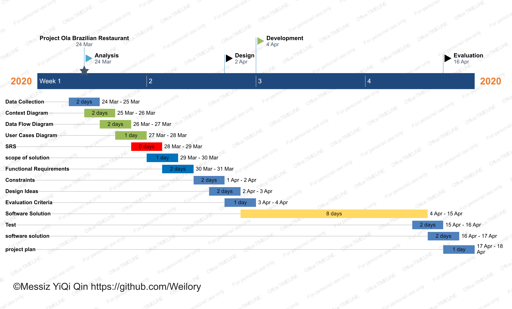
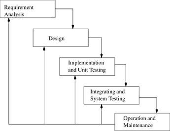
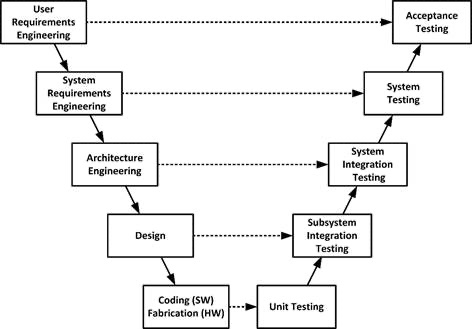
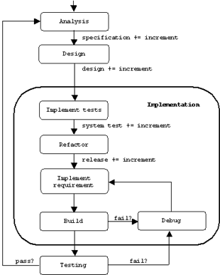
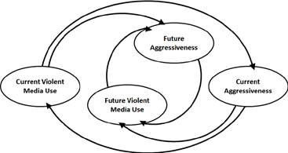
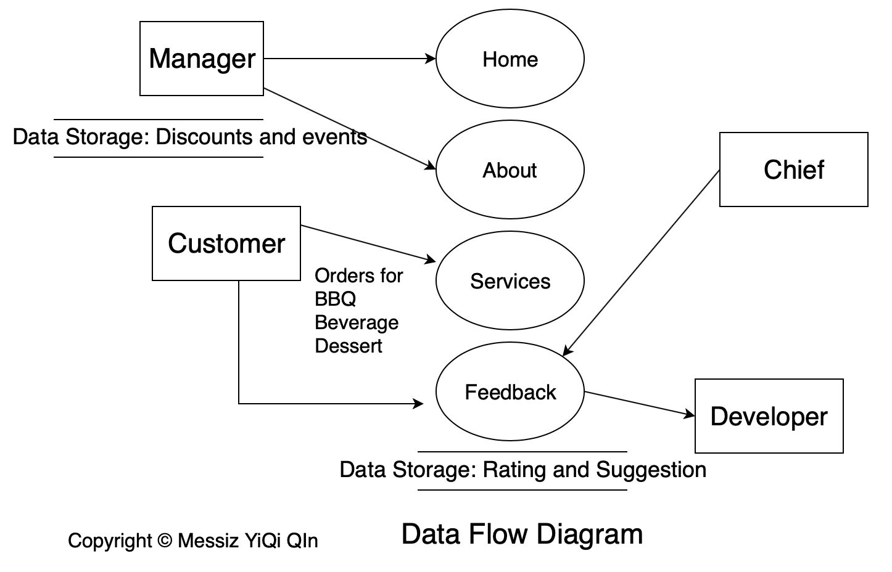

# Copyright

1. Developer
* Messiz YiQi Qin

2. Organization
* Taylors College

3. Languages
* HTML5
* ECMAScript6
* CSS3

4. Frameworks
* [font awesome](https://fontawesome.com/icons?d=gallery)

# Design Brief

> Ola is a Brazilian barbeque resturant which located in Australia. Recently they are expanding their business, which requires a website for costumers to check out discounts and events, ordering online and give feedback. 

# Gannt Chart

# Development Model Analysis

>	The system development life cycle (SDLV) is a concept that widely utilised in project management that specifies the different stages of system project development. (Rouse, 2009) Generally, a feasibility report that tells how tangible it is to achieve the project. 
>	Waterfall, Agile and Spiral models are three main models to abstract in this report, which are the basic prototypes. Nowadays, they are easiest and most popular ones for people to use. 
> 	Waterfall development model features factorial development, which is traditional step-by-step SDLC (Software Development Life Cycle) development model which requires developer’s clear identification to production factors. Procedures such as analysis, design, implementation, testing and maintenance (TP, 2020) This model is always utilised together with Software Requirements Specification (SRS), which contains a complete description of the behaviour of the software to be developed, both functionally and non-functionally. The strength includes convenience and easiness, sustainability which addressed by fully documentation, each part of progress is accessible, which makes the conclusion of the project welly defined from the beginning. However, it lacks of flexibility due to rigid process also, detailed documentation may cause stress as reading, and, the software will only be allowable at the end of timeline (TP, 2007) Therefore, not suitable for magnificent project as logic thread corrupts when meets chasm between each stages. 

> Verification and validation model is famous for its V-shaped developing shape, with each conduction corresponding to a plan pre-step, through the process of validation (Powell-Morse, 2016) Functionality is guarantined as well as validity. V-model can be regarded as a modified-Waterfall-model, the main differences which specified validation technical architecture design is include in v-model. The planning steps including verification, Requirements, design contributes to build up for system configuration development, steps of validations including Unit and integration, installation, functionality dedicates to validate system configuration development according to requirements asserted at the start. Apparently, v-model performs in high functionality and requires lots of validating logic, which would be absolutely suitable for magnificent project of many functionality, however, it can be extremely complex, especially when the target audience’s requirements varies.  

> V-model for Testing @Donald Firesmith

> Agile model is a methodology for modelling and documenting software systems based on best practices. There are many Agile methodologies, such as Extreme Programming (XP), Scrum, Dynamic System Development Method, Crystal Method, Feature-Driven Development, Lean Development, Adaptive Software Development. (CS SJSU) Agile models are based on a collection of values and principles, that can be applied on an agile software development project (Wikipedia). The agile methodology involves individual and interactions over process and tools, working software over comprehensive documentation, customer collaboration over contact negotiation, responding to change over following a plan. Overall, Agile software model prefers flexibility, communication, collaboration and simplicity. In this model, a life cycle of plan, design, build, test and finally review is repeated over and over again, therefore the software is fast to release with new functionality. The main advantage of agile model attributes to the idea of collaboration, stating the goal and get people involved and try to solve the problem together. GitHub collaborating project exemplifies software agile model, which signifies the idea of bringing people together and contribute to the project (Unito, 2018). Agile model enables quick release, once the software passes Minimum Viable Product (MVP), the product can be accepted. The other popular kind other than scrum, refers to Lean Model, which is a continuous flow method, whereas Agile Begins a new iteration. The design process of Agile model regarded as “Scrum” allows a modifiable circulation in the developing process of a software. A scrum circle involves product backlog, which are requirements arranged for the production, sprint backlog, which is comprised of the highest priority requirements (usually functionality), third step sprint indicates work done for each day, finally Release, each sprint result in key functionality being delivered. The benefits of Agile software development cycle including short and rapid interactions segment the project, functional requirements can be modified quickly, and risks are reduced. It can also result in early product release and clients can have close look to check if their expectation is satisfied (Segue, 2015). However, using an agile modelling requiring developing skills of the developer, with ability to listen and respond to clients.

> Agile Model: Method Driven Implement @CS

> The last on to introduce refers to Spiral Development Model, which is very similar to Scrum Agile Model we already discussed. The Spiral Model is famous for iteration, repetitions of the process eliminate the risk and guaranines the quality. Once the application satisfies MVP (Minimum Viable Product), it can be released. Four significant steps, determine objectives, identify risks, development and test, plan and next iteration allows quick development. As shown above, Spiral Development Model differs from Scrum Agile Model from risk-preventing procedure, which the prototype of Spiral is designed for risk-elimination. However, due to large amount of documentation and iterations, it’s more time-consuming, therefore, Spiral model costs more economically. As well, high skills sets are necessary for each stage to be effective. 

> Spiral Model: Risk Driven Methodology @Thorsten Quandt

> Ola Brazilian Restuarant Project is suitable for Agile Model. The reasons follows by

* The Project identified as small project which is scheduled to be finished in 1 month, limited functionality does not require sophisticated Waterfull or Spiral model. 

* Agile is flexible that promotes communication between developer and business owner, which eliminates risks of not satisfying client wants. 

### Extend

> For backend, if select from tidb, mysql, sqlite3, mongoDB. Node.js and MongoDB is best solution suitable for the project since the project excludes content heavy calculation. which the costumer sent request to the kitchen to order food, the main data transaction is encoded json. 

### Reference

- [the Waterfall Model, Zhi Ming Liu, 2018](https://www.researchgate.net/figure/The-Waterfall-Model_fig3_243611940)

- [Using V Models for Testing, Donald Firesmith, NOVEMBER 11, 2013 • SEI BLOG CS EDU, agile methodologies](http://www.cs.sjsu.edu/~pearce/oom/se/agile.htm) 

- [Margaret Rouse, USA, Whatls.com, TechTarget](https://searchsoftwarequality.techtarget.com/definition/systems-development-life-cycle)

- [SDLC – anonymous, Waterfall Model, Tutorial Point, 2007](https://www.tutorialspoint.com/sdlc/sdlc_waterfall_model.htm)

- [Anonymous, Strength and Weakness of modified waterfall table](https://www.researchgate.net/figure/Strengths-Weaknesses-of-Modified-Waterfall_tbl2_258959806)

- [V-model, Andrew Powell-Morse, SDLC, December 26, 2016](https://airbrake.io/blog/sdlc/v-model) 

- [Agile Modelling, Wikipedia](https://en.wikipedia.org/wiki/Agile_modeling#References)

- [Agile methodology GitHub, Unito Team, Feb 16th, 2018](https://unito.io/blog/github-projects-agile/)

- [Benefits of Agile Software Development, August 25th  2015, Segu Technologies](https://www.seguetech.com/8-benefits-of-agile-software-development/)

# Data Collection

<table>
	<tr>
		<th>Data Needed</th>
		<th>Data Sources</th>
		<th>Collection Method</th>
		<th>Justification</th>
	</tr>
	<tr>
		<td>Customer amount in differnt period</td>
		<td>Record</td>
		<td>Observation</td>
		<td>manage traffic handling</td>
	</tr>
	<tr>
		<td>popular BBQ dishes</td>
		<td>Internet</td>
		<td>Research</td>
		<td>create sample dishes</td>
	</tr>
	<tr>
		<td>restaurant discounts styles</td>
		<td>Internet</td>
		<td>Research</td>
		<td>integrite sales strateges on placing an order</td>
	</tr>
	<tr>
		<td>Customers' ages</td>
		<td>Record</td>
		<td>Observation</td>
		<td>get to know the target audience therefore wisely distribute recomendation</td>
	</tr>
	<tr>
		<td>Restaurant's popular dishes</td>
		<td>client</td>
		<td>interview</td>
		<td>put them on special</td>
	</tr>
	<tr>
		<td>Customer's tech choice</td>
		<td>costumers</td>
		<td>questionnaire</td>
		<td>get to know what type of devices customers majorly use</td>
	</tr>
</table>

# Context Diagram

# Data Flow Diagram

# User Cases Diagram

# SRS

> An analysis that defines requirements, constraints and scope of a solution in the form of a SRS (Software Requirements Specification)

1. Introduction
	1. Client: Ola is a Brazilian barbeque resturant which located in Australia. 
	2. Problem description: Recently they are expanding their business, which requires a website for costumers to check out discounts and events, ordering online and give feedback.
	3. Purpose & audience: The objectives including allowing in-restaurant costumers to order food, outside customers to check out discounts and events, manager to publish discounts and events, all people using the application to give suggestions to the website, developer to recieve suggestions. 

2. System Description
	1. Project scope: The system does not require an authentication system or financial transaction system. The main function is for information transferring. 
	2. User characteristics 
		* Business owner, manager, who can organize and publish discounts and events.
		* Chief: recieve orders, add or remove dishes to the menu.
		* customers: sent orders

3. Environmental characteristics
* mobile phone, laptop, any device that has a screen and is connected to network will have access to the website. 

3. Constraints
	1. Economics: The website is not for profit, though it is expected to grow the business. From this aspect, we need to make functionality as easy and understandable.
	2. Functionality: The key functions listed:
		* Backend
			- dish menu
			- feedback
			- orders
		* Frontend
			- discounts and events feed
			- menu to display and form to order

4. Deadline
* Tue 20 Apr 2020

5. System Features
	1. Functional requirements: navigation bar consistantly exist in app application. home page display carousel to show special dishes, provide links to social media. about page provide video. services page offers customers with menu, each dish has a price and an image. feedback page allow user to contact developer in noreply. 

4. Non-functional Requirements
	1. Legal Responsibility: The website must strictly follows "Website Legal Requirements Australia", which it mustn't leak out user's private information and mustn't cause any damage to the user's equipment. 
	2. Convenience & User Protection: use relative sizing to allow user to visit the website in any device. the system does not have an authentication system, hence users are perfectly save without any risk of information leaking. 

# Design Ideas

* home page

* * display carousel to show special dishes, provide links to social media. 

* about page 

* * provide video. 

* services page 

* * offers customers with menu, each dish has a price and an image. 

* feedback page 

* * allow user to contact developer in noreply. 

# Software Solution

<table>
	<tr>
		<th>Question</th>
		<th>Justification</th>
		<th>The process used to evaluate the success of the product</th>
		<th>How the finish product would be tested or checked</th>
	</tr>
	<tr>
		<td>Validation(Will user mistakenly select a decimal or negative number as quantity to order?)</td>
		<td>User should only entry natural number indicate quantity</td>
		<td>check by different input</td>
		<td>make sure error is reported when an invalid quantity is entried</td>
	</tr>
	<tr>
		<td>Completeness (Were all of the functional and non-functional requirements that were required by the client implemented in the software system?)</td>
		<td>The software solution will be fully functional, during testing, no error allowed. It needs to meet the requirements listed by client in SRS. </td>
		<td>How many errors appears when test the result. </td>
		<td>Make sure there are no errors in anywhere in the program when publish. </td>
	</tr>
	<tr>
		<td>Readability (Can every part of the software program be easily read by its users? Are the fonts chosen appropriate in size and face to the system on which the software is installed? Are contrast ratios acceptable?Is the text colour readable against the background colour?)</td>
		<td>User friendly interface is required. The main target audience is households that have pets, the way of online booking needs to be as simple as possible. </td>
		<td>Ask user for views of the information to improve clarity. </td>
		<td>All background colour doesn’t blur with foreground colour, all fonts are adjusted to appropriate size. </td>
	</tr>
	<tr>
		<td>Attractiveness (Are the colours used throughout the software complementary? Are the colour choices appropriate to the context?)</td>
		<td>For user experience, the interface must be visual appealing and interactive. </td>
		<td>As client for opinion on visual effect. Justify fonts and background colours to appropriate. </td>
		<td>The layout is simple and straight-forward.</td>
	</tr>
	<tr>
		<td>Clarity (Is the language used in the software age-appropriate? Are headings, labels and buttons consistently used throughout the software?)</td>
		<td>Make sure all information in the page is clear enough. No mis-spelling words or blurred areas. </td>
		<td>Make sure the website doesn’t contain any spam information. </td>
		<td>All headings, labels and buttons should be adjusted in appropriate size. </td>
	</tr>
	<tr>
		<td>Functionality (Does the system respond appropriate to user input errors? What percentage of uptime does the software have?)</td>
		<td>User input needs to be validated. </td>
		<td>Validate email by regex. Validate unexpected result by showing a warning. </td>
		<td>Input dummy data to the form to check if there is any warning. </td>
	</tr>
	<tr>
		<td>Accuracy (Is all of the data stored accurate in relation to how it was entered? Are all calculations accurate 100% of the time? Are all reports produced within the correct data ranges, including boundary values?)</td>
		<td>Use a foreign key to link a user with all the data belongs to him/her. </td>
		<td>Test multiple times, check the outcome if it is the expected result. Apply encoding of base64 for user id. Utilize transform layer security on password reset.  </td>
		<td>Check output report to see if there are any error or unwanted data. </td>
	</tr>
	<tr>
		<td>Accessibility (How well can the system be accessed by someone who is hearing impaired or vision impaired? Does the solution use a colour-blind safe palette? Do all images have an Alt-tags? Will a screen reader work with your solution?)</td>
		<td>Anyone who have internet access will be able to access our service. </td>
		<td>Show warning if frontend is not supported by the browser </td>
		<td>Try to access the website from another mobile device to check if it still fits the requirements. </td>
	</tr>
	<tr>
		<td>Timeliness (Does the software respond to requests within an acceptable timeframe?)</td>
		<td>Each developing step should follow the Gannt chart. </td>
		<td>Make sure each developing step is finished in time. Update Gannt chart as each step finishes.</td>
		<td>Check timeline to mark finish and overdue. </td>
	</tr>
</table>

# Test Procedure

1. clone the repo
2. open `home.html`, the 3 stripes in the rightward will direct you to corresponding page. if you click on the logo, it directs you back to the home page. 
3. in home page, clicking on icons below will direct to corresponding contact channel. 
4. in about page, the slider each contains a video and a text introduction. 
5. in services page, all products are divided into 3 parts: BBQ, beverage and dessert. select items, after that, when you open your trolley, you can see the items you've selected. 
6. in feedback page, you can rate the website and write a suggestion.

# Evaluation

<table>
	<tr>
		<th>Criteria</th>
		<th>measure efficiency and effectiveness</th>
		<th>how the solution meets the criteria</th>
		<th>functional and non-functional requirements</th>
	</tr>
	<tr>
		<td>Validation(Will user mistakenly select a decimal or negative number as quantity to order?)</td>
		<td>effective</td>
		<td>when user entry invalid input, error message shows up</td>
		<td>sufficient effectiveness</td>
	</tr>
	<tr>
		<td>Completeness (Were all of the functional and non-functional requirements that were required by the client implemented in the software system?)</td>
		<td>all the functionalities work</td>
		<td>frontend works</td>
		<td>lack of effectiveness since lack of backend</td>
	</tr>
	<tr>
		<td>Readability (Can every part of the software program be easily read by its users? Are the fonts chosen appropriate in size and face to the system on which the software is installed? Are contrast ratios acceptable?Is the text colour readable against the background colour?)</td>
		<td>For a nice and clear experience, make things clear as possible.</td>
		<td>All information are clearly shown</td>
		<td>Image slider, navigation bar and booking forms are apparent and straight-forward</td>
	</tr>
	<tr>
		<td>Attractiveness (Are the colours used throughout the software complementary? Are the colour choices appropriate to the context?)</td>
		<td>frontend is based on well-designed color platte</td>
		<td>dynamic and visual-appearing</td>
		<td>Propaganda for the business in succeed.</td>
	</tr>
	<tr>
		<td>Clarity (Is the language used in the software age-appropriate? Are headings, labels and buttons consistently used throughout the software?)</td>
		<td>All compositions are age relevant </td>
		<td>apply colour and hue in a warm fashion </td>
		<td>User know where to focus</td>
	</tr>
	<tr>
		<td>Functionality (Does the system respond appropriate to user input errors? What percentage of uptime does the software have?)</td>
		<td>user can only check out infomation but order due to the lack of backend</td>
		<td>missing order function</td>
		<td>insufficient since one important function is missing currently</td>
	</tr>
	<tr>
		<td>Accuracy (Is all of the data stored accurate in relation to how it was entered? Are all calculations accurate 100% of the time? Are all reports produced within the correct data ranges, including boundary values?)</td>
		<td>each food item is separated into right category</td>
		<td>the trolley displays the right selected items</td>
		<td>sufficient effectiveness</td>
	</tr>
	<tr>
		<td>Accessibility (How well can the system be accessed by someone who is hearing impaired or vision impaired? Does the solution use a colour-blind safe palette? Do all images have an Alt-tags? Will a screen reader work with your solution?)</td>
		<td>None of the feature attributes to help disabled people to understand the page.</td>
		<td>audio trace can to be approved next time. </td>
		<td>sufficient for standard customers</td>
	</tr>
	<tr>
		<td>Timeliness (Does the software respond to requests within an acceptable timeframe?)</td>
		<td>Some of the schedules do not match the gannt chart</td>
		<td>planning and debugging causes more time than I thought</td>
		<td>sufficient because the project is finished way earlier than deadline</td>
	</tr>
</table>

# Development Log

#### Mon 1 Apr 13\:23~14\:47
	
> * home app (finished)\: consists of logo, nav bar, carousel and slogon. 
> * feedback app (finished)\: allow user to post suggestion on site. backend absent. 

#### Mon 1 Apr 16\:47~17\:05

> * home app
> * pull in carousel, design slogon, pull in text infinite gradient

#### Mon 1 Apr 20\:15~21\:00

> * home app
> * add icons to facebook, instagram and developer organization and personal account

#### Fri 2 Apr 8\:51~9\:50

> * feedback page
> * pull in feedback app
> * pull in icon and nav bar 
> * fix feedback app smiley face positioning priority
> * pull in Info

#### Fri 2 Apr 18\:45~23\:37 

> * services app\: shopping section contains bbq, beverage and dessert
> * item base card object for three categories to inherit
> * panel main frontend in support of final shopping car

#### Sat 3 Apr 9\:40~10\:16

> * services app\: shopping-cart auto-indexial change waiting for optimization 

#### Mon 5 Apr 4\:30~4\:53

> * services app\: seperate into sections\: bbq, beverage and dessert
> * pull in Info to show message
> * create products.py
> * pull in Path and Database
> * pull in RGBA for customizing theme

#### Mon 5 Apr 21\:10~22\:41

> * services app\: 
> * *  create ItemBase 
> * * * BBQ, Beverage, Dessert inherits ItemBase
> * * * ItemBase is for static element and basic interaction
> * * * an ItemBase is a card with an image and name of the dish
> * * Create Quantity 
> * * * a subtract and addition bar for modifying quantity, implement natural number validation
> * * Create Trolley
> * * * a shopping cart, user uses to see what he has ordered

#### Tue 6 Apr 10\:32~12\:35

> * create Shelf 
> * * just like a book shelf, you can set a maximum amount to display for each row, after it is full, jump to the next row automatically. 
> * * define config, which change the row allowance and rephrase the items in shelf

#### Tue 6 Apr 18\:40~19\:20

> * create PanelMain<singleton>
> * * pull in ShowHide to animate Trolley open and close
> * * seperate views in 3\: bbq, beverage and dessert
> * * <wait to be optimized>create load functions to load all food items at once. This has low efficiency if there are many food items, if the resturant has more than 100 dishes, optimize it by pagination

#### Wed 7 Apr 7\:20~8\:15

> * home page
> * animate navigation bar
> * combine logo and nav bar into header

#### Wed 7 Apr 13\:00~14\:15

> * Associate Item, Trolley and Quantity together. When Quantity of a certain Item is modified, apply change to Trolley.
> * create CartItemBase
> * * ordered item in trolley
> * * * has a background image, price for each and quantity object which indicate how many this dish has been ordered
> * associate CartItemBase Quantity with ItemBase Quantity
> * * define an associate method in Quantity object, since Quantity object has callback triggering by addition, subtraction and blur out. (purpose is to remove CartItemBase from Trolley if quantity is decreased to zero, and to add CartItemBase item to Trolley if quantity is more or equan to one) those main callbacks should be combined in association

#### Fri 9 Apr 9\:30~12\:51

> * Build PanelMain, enabel tag click 
> * there are 3 tags\: bbq, beverage and dessert
> * as a tag is clicked, load main section to corresponding 
> * CartItemBase object (BBQCartItem, BeverageCartItem, DessertCartItem)

#### Sat 10 Apr 16\:45~17\:30

> * create Page<singleton>
> * * apply wheater styling on nav bar (1)
> * * add left right arrow, add bullet
> * create Bullet object
> * * support Page to turn
> * * has an activate and deactivate function to change status
> * * has a click callback

#### Sun 11 Apr 10\:00~11\:20

> * create about.json, with video src and brief text advertisement, for about page. 
> * Ideas comes from\: (2)

#### Sun 11 Apr 16\:30~17\:30

> * services page
> * trying to fix dessert and cloudy positioning, failed to fix

#### Mon 12 Apr 8\:27~9\:31

> * pull in home nav bar, services app finished.

#### Mon 12 Apr 18\:00~20\:50

> * sort out documentation, write readme
> * publish

# Summary 

* Total Development Minutes: 1527
* Day Span: Mon 1 Apr ~ Mon 12 Apr 

### Reference

#### (1)

	> codepen: https://codepen.io/_fbrz/pen/iqtlk 
	> author: Fabrizio Bianchi

#### (2)
 
	> article: Sample Texts for Restaurants to Run Successful SMS Campaign
	> url: https://medium.com/@sm.adnsms/sample-texts-for-restaurants-to-run-successful-sms-campaign-b60a81baf61d

### Tools used

#### (1)

	> [draw context, data-flow, user-cases diagrams](https://www.diagrameditor.com)

